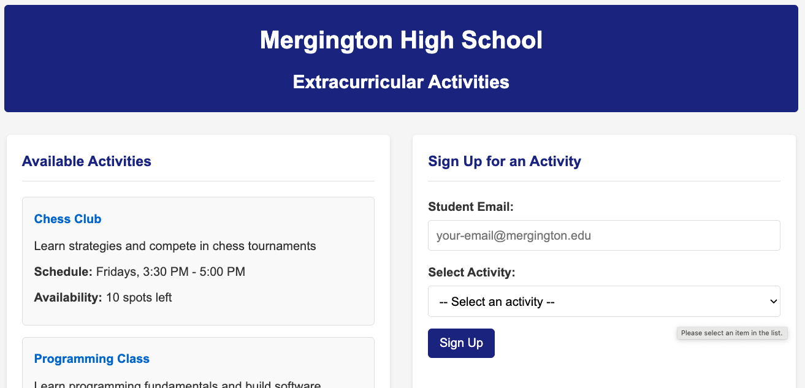
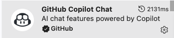
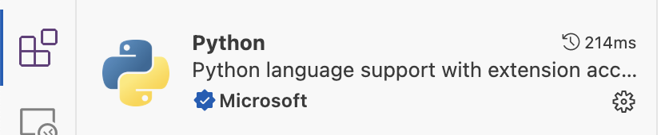
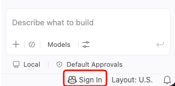
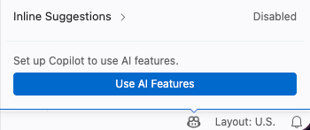
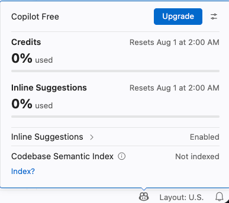
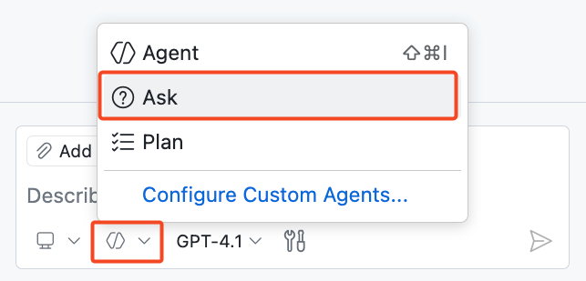
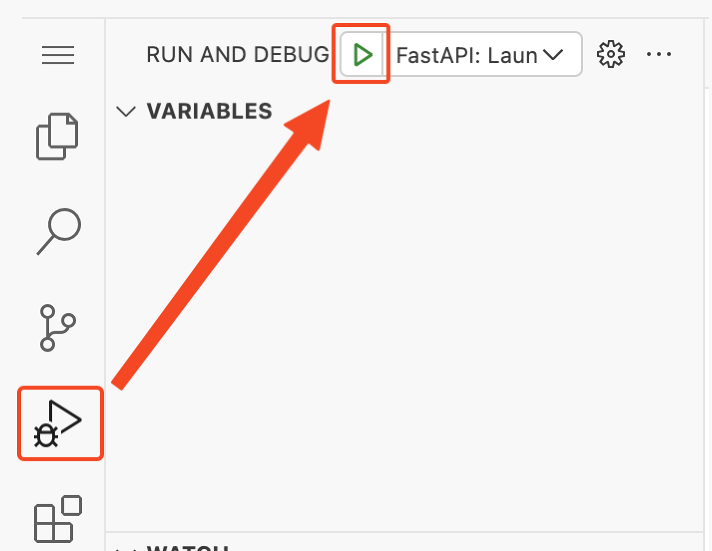

## Step 1: Copilot を使ってみる

**「Getting Started with GitHub Copilot」**演習へようこそ！ :robot:

演習では、GitHub Copilot のいろいろな機能を使って、Mergington High School の生徒が課外活動に申し込めるウェブサイトを作り込んでいきます。 🎻 ⚽️ ♟️



### 📖 理論: GitHub Copilot を知る


GitHub Copilot は AI コーディングアシスタントです。コードを速く、少ない手間で書けるようにし、問題解決や共同作業により多くの力を使えるようにします。

GitHub Copilot は開発者の生産性を高め、ソフトウェア開発の速度を上げることが確かめられています。詳しくは GitHub ブログの [Research: quantifying GitHub Copilot's impact on developer productivity and happiness](https://github.blog/news-insights/research/research-quantifying-github-copilots-impact-on-developer-productivity-and-happiness/) を参照してください。

IDE で作業するとき、GitHub Copilot とは主に次の形でやり取りします。

| やり取りの方法             | 📝 説明                                                                                                      | 🎯 向いている場面                                                              |
| ------------------------- | ------------------------------------------------------------------------------------------------------------ | ----------------------------------------------------------------------------- |
| **⚡ Inline suggestions** | 入力中に AI がコード候補を表示します。1 行から関数全体まで、文脈に合った補完を出します。                        | 今書いている行の補完。ときにはコードのかたまり全体                             |
| **💭 Inline Chat**        | 今開いているファイルや選択範囲に絞ったチャット。特定のコードについて質問できます。                              | コードの説明、特定の関数のデバッグ、狙いを定めた改善                           |
| **💬 Ask Mode**           | コードベース、コーディング、技術一般の概念についての質問に答えることに向いたモードです。                        | コードの動きの理解、アイデア出し、質問                                         |
| **🤖 Agent Mode**         | ほとんどのコーディング作業で推奨される既定のモード。自律的に編集し、ツールを使い、作業が終わるまで進めます。    | 日々のコーディング作業。範囲の狭い修正から、複数ファイルにまたがる実装まで     |
| **🧭 Plan Agent**         | コードを変更する前に、計画を書き出し、確認の質問をすることに向いたモードです。                                  | 先に計画をレビューしてから実装に渡したいとき                                   |

作業していくと、GitHub Copilot は `github.com` のサイト上のいろいろな場所や、VS Code・JetBrains・Xcode といった普段の開発環境でも手助けしてくれることがわかります。

ただし今日のコーディングでは、[GitHub Codespace](https://github.com/features/codespaces) という設定済みの開発環境の中で VS Code を使って練習します。

> [!TIP]
> 現在の機能と今後の機能については、[GitHub Copilot Features](https://docs.github.com/en/copilot/about-github-copilot/github-copilot-features) のドキュメントで学べます。

### :keyboard: やること: Copilot Chat にプロジェクトを紹介してもらう

まず開発環境を起動し、Copilot にプロジェクトのことを教えてもらい、実際に動かしてみましょう。

1. 下のボタンを使って、**Create Codespace** のページを新しいタブで開きます。設定は既定のままで構いません。

   [](https://codespaces.new/{{full_repo_name}}?quickstart=1)

1. **Repository** の欄が、元のリポジトリではなく演習のコピーになっていることを確認してから、緑色の **Create Codespace** ボタンをクリックします。
   - ✅ 自分のコピー: `/{{full_repo_name}}`
   - ❌ 元のリポジトリ: `/skills/getting-started-with-github-copilot`

1. ブラウザーの中で Visual Studio Code が読み込まれるまで少し待ちます。
1. 左のサイドバーで拡張機能タブをクリックし、`GitHub Copilot Chat` と `Python` の拡張機能がインストールされ、有効になっていることを確認します。

   

   

   <details>
   <summary>🔎 GitHub Copilot Chat 拡張機能が見当たらないとき ❓</summary>

   GitHub Copilot Chat の拡張機能が見当たらない場合は、GitHub Copilot にサインインしているか確認してください。VS Code ウィンドウの右下にある **GitHub Copilot** アイコンを探します。

   | ステータスバーのアイコン                                                                                                | サインインが必要                                                                                         | Copilot が有効                                                                                                  |
   | ----------------------------------------------------------------------------------------------------------------------- | -------------------------------------------------------------------------------------------------------- | --------------------------------------------------------------------------------------------------------------- |
   |  |  |  |

   サインインが確認できていれば、拡張機能タブに表示されていなくても先に進めます。

   </details>

1. VS Code の上部にある **Toggle Chat アイコン**を見つけてクリックし、Copilot Chat のサイドパネルを開きます。

   

   > 🪧 **注:** GitHub Copilot を初めて使う場合は、先に進むために利用規約への同意が必要になることがあります。


1. 最初のやり取りなので、**Ask Mode** になっていることを確認します。

   

1. 次のプロンプトを入力して、Copilot にプロジェクトを紹介してもらいます。

   > 
   >
   > ```prompt
   > Please briefly explain the structure of this project.
   > What should I do to run it?
   > ```

   > 🪧 **注:** Copilot が案内する手順に従う必要はありません。環境はすでに用意してあります。

1. プロジェクトのことが少しわかったので、実際に動かしてみましょう。左のサイドバーで `Run and Debug` タブを選び、**Start Debugging** アイコンを押します。

   

1. ブラウザーでウェブページを見たいので、URL とポートを探します。表示されていない場合は、下部のパネルを開いて **Ports** タブを選びます。

1. 一覧からポート `8000` と、対応するリンクを探します。リンクにマウスを重ね、**Open in browser** のアイコンを選びます。

   

### :keyboard: やること: ターミナルのコマンドを Copilot に思い出させてもらう 🙋

よくできました！ アプリのことがわかり、動くことも確認できたので、次はカスタマイズ用のブランチを作るのを Copilot に手伝ってもらいましょう。

1. VS Code の下部パネルで **Terminal** タブを選び、右側のプラス `+` をクリックして新しいターミナルウィンドウを作ります。

   > 🪧 **注:** 新しいターミナルを使うと、ウェブアプリを動かしている既存のデバッグセッションを止めずに済みます。

1. 新しいターミナルウィンドウの中で、キーボードショートカット `Ctrl + I`（Windows）または `Cmd + I`（Mac）を使い、**Copilot の Terminal Inline Chat** を開きます。

1. 忘れてしまったコマンド（ブランチを作って publish する方法）を Copilot に聞いてみましょう。

   > 
   >
   > ```prompt
   > Hey copilot, how can I create and publish a new Git branch called "accelerate-with-copilot"?
   > ```

   > 💡 **ヒント:** 思ったとおりの答えが返ってこなくても、必要なことを続けて説明できます。Copilot は会話の履歴を覚えていて、次の応答に反映します。

1. `Run` ボタンを押すと、Copilot がターミナルのコマンドを入れてくれます。コピーと貼り付けは不要です。

1. 少し待ってから、VS Code の下部ステータスバーの左側で現在のブランチを確認します。`accelerate-with-copilot` になっていれば、この Step は完了です。

1. ブランチが GitHub に push されたので、Mona が作業を確認しています。少し待って、コメントを見てください。進捗と次の Step が投稿されます。

<details>
<summary>うまくいかないとき 🤷</summary><br/>

反応がないときは、次を確認してください。

- ブランチ名が正確に `accelerate-with-copilot` になっているか（前後に余計な文字を付けない）。
- ブランチが実際にリポジトリへ publish されているか。

</details>
