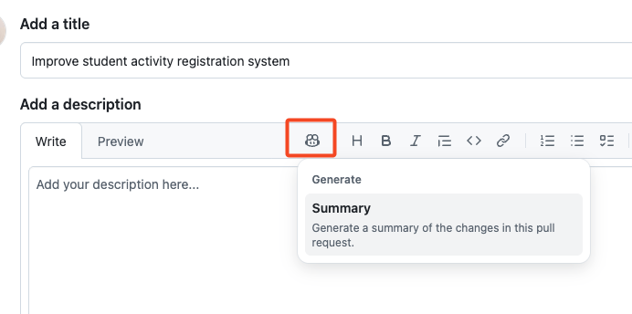
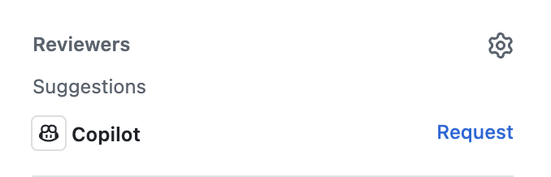

## Step 5: pull request で GitHub Copilot を使う

おめでとうございます！ 演習のコーディング（と VS Code での作業）は終わりです。あとは作業をマージするだけです。 :tada: 締めくくりに、pull request を速く進められる、利用が限られた 2 つの Copilot 機能を学びましょう。

### 📖 理論: pull request のための GitHub Copilot

#### Copilot pull request summaries

ふだんは、自分のメモやコミットメッセージを見返して、pull request の説明としてまとめます。コミットメッセージがそろっていなかったり、コードに説明が足りなかったりすると、まとめるのに時間がかかります。Copilot は pull request のすべての変更を見て、重要なところを参照付きで示してくれます。

#### Copilot code review

作業は多くの目で見てもらうほどよいので、通常のピアレビューの前に、Copilot に一度見てもらいましょう。Copilot は、簡単な調整で直せるよくある間違いを見つけるのが得意です。ただし、責任を持って使うことを忘れないでください。

> [!NOTE]
> 2 つの機能は **GitHub Copilot** の有料プランでのみ使えます。[[docs]](https://docs.github.com/en/copilot/get-started/plans)

### :keyboard: やること: Copilot で PR を要約してレビューする

**Copilot pull request summaries** と **Copilot code review** はどちらも利用が限られているため、以下の手順のほとんどは任意です。利用できない場合は、任意と書かれた手順を飛ばしてください。

1. ブラウザーで別のタブを開き、演習リポジトリを開きます。

1. 新しい pull request の作成をすすめる**通知バナー**が出ているかもしれません。バナーをクリックするか、上部の **Pull Requests** タブから **pull request を新規作成**します。次の内容を使ってください。

   - **base:** `main`
   - **compare:** `accelerate-with-copilot`
   - **title:** `Improve student activity registration system`

1. （任意）PR の説明欄のツールバーで **Copilot** アイコンをクリックし、**Summary** を選びます。少し待つと、変更内容にもとづいた説明が Copilot によって追加されます。 :memo:

   

1. （任意）右側の情報パネルの上部にある **Reviewers** の欄で、**Copilot アイコン**の横の **Request** ボタンをクリックします。少し待つと、Copilot が pull request にレビューコメントを追加します。

   

   > 💡 **ヒント:** Copilot にレビューを依頼した記録がログに残ることに注目してください。

1. 一番下の **Merge pull request** ボタンを押します。よくできました！ 完了です。 :tada:

1. Mona が作業を確認しています。少し待って、コメントを見てください。フィードバックと、演習の最終レビューが投稿されます。
